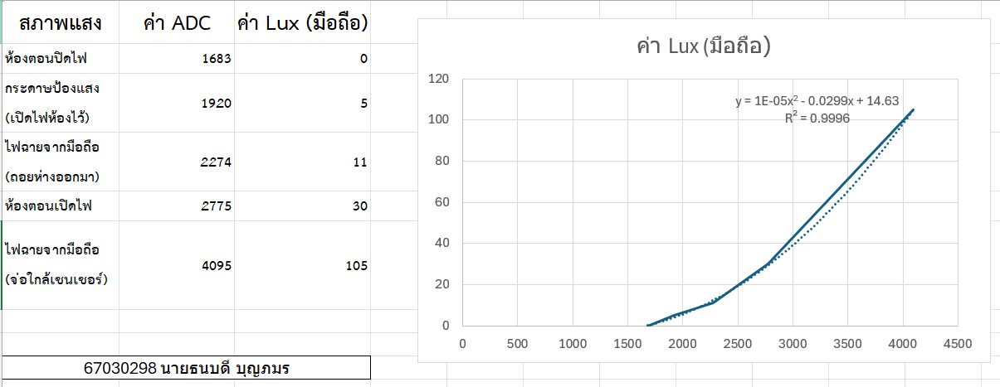

# **ส่วนที่ 1 — ความรู้พื้นฐาน**

### **1.6 คำนวณแรงดันเอาต์พุตจากวงจร**
| สภาพแสง  | ความต้านทาน   | แรงดันเอาต์พุต (โวลต์) |
| -------- | ------------- | ---------------------- |
| มืดสนิท  | 200 kΩ – 2 MΩ | 0.02 – 0.16            |
| ห้องปกติ | 10 kΩ – 50 kΩ | 0.55 – 1.65            |
| กลางแจ้ง | 200 Ω – 2 kΩ  | 2.75 – 3.24            |

## **ส่วนที่ 4 — การเก็บข้อมูลเพื่อทำ Calibration**
| สภาพแสง                          | ค่า ADC | ค่า Lux (มือถือ) |
| -------------------------------- | ------- | ---------------- |
| ห้องตอนปิดไฟ                     | 1683    | 0                |
| กระดาษป้องแสง (เปิดไฟห้องไว้)    | 1920    | 5                |
| ไฟฉายจากมือถือ (ถอยห่างออกมา)    | 2274    | 11               |
| ห้องตอนเปิดไฟ                    | 2775    | 30               |
| ไฟฉายจากมือถือ (จ่อใกล้เซนเซอร์) | 4095    | 105              |

## **ส่วนที่ 5 — การทำกราฟ เพื่อหาสมการ**


## **ส่วนที่ 6 — การทำ Calibration ในโค้ด**
```c
float lux = 0.00001 * raw * raw - 0.0299 * raw + 14.63;
```

## **ส่วนที่ 7 — การทดสอบผลลัพธ์**

ให้นักศึกษาทดสอบ 3 จุดแสงใหม่ที่ไม่ได้ใช้ตอนเก็บข้อมูล เช่น:

| สภาพแสงใหม่    | ADC  | Lux มือถือ | Lux จากโค้ด |
| -------------- | ---- | ---------- | ----------- |
| หน้าต่าง       | 528  | 0          | 1.63        |
| ใต้โต๊ะ        | 576  | 0          | 0.73        |
| หน้าจอโน๊ตบุ็ค | 2193 | 26         | -2.85       |

ให้นักศึกษาวิเคราะห์ว่า

- ความคลาดเคลื่อนอยู่ในระดับที่ยอมรับได้หรือไม่
> ยอมรับได้เฉพาะช่วงแสงน้อยเพราะค่า Lux คลาดเคลื่อนจากมือถือเพียงเล็กน้อย แต่ในสภาพแสงที่สว่างขึ้นถือว่ายอมรับไม่ได้ เนื่องจากค่าที่คำนวณออกมาติดลบซึ่งผิดจากความเป็นจริง สาเหตุหลักมาจากสมการในโปรแกรม Excel ถูกปัดเศษทศนิยมมากเกินไป ทำให้สูญเสียความแม่นยำเมื่อต้องนำไปคำนวณกับค่า ADC ที่สูงขึ้น

- สมการ Linear หรือ Polynomial เหมาะกว่ากัน
> สมการแบบ Polynomial เหมาะสมกว่า เพราะตามทฤษฎีความสัมพันธ์ระหว่างความต้านทาน LDR กับความเข้มแสงจะเปลี่ยนแปลงแบบเส้นโค้ง ไม่ได้แปรผันเป็นเส้นตรง การใช้สมการ Polynomial จึงช่วยให้เส้นแนวโน้มสามารถปรับโค้งทาบทับกับข้อมูลจริงได้แม่นยำกว่าการใช้เส้นตรงแบบ Linear

## **ส่วนที่ 8 — คำถามท้ายใบงาน**

1. ทำไมต้องใช้ Voltage Divider ในการอ่าน LDR?
> เพราะบอร์ดรู้จักแค่แรงดันไฟแต่ไม่สามารถอ่านความต้านทานของ LDR ตรงๆได้ จึงต้องต่อวงจร Voltage Divider เพื่อแปลงค่าความต้านทานให้เป็นแรงดันไฟก่อน บอร์ดถึงจะรับรู้และอ่านค่าได้

2. ทำไมต้องเก็บข้อมูลหลายจุดก่อนทำ Calibration?
> เพราะค่าความต้านทานของ LDR กับความสว่างไม่ได้เปลี่ยนค่าเป็นเส้นตรงแต่มีลักษณะเป็นเส้นโค้ง ถ้าเก็บค่าแค่ 1-2 จุด สมการที่ได้จะคลาดเคลื่อน การเก็บหลายระดับแสงจะช่วยให้สร้างสมการเส้นโค้งได้แม่นยำและใกล้เคียงความจริงที่สุด

3. ถ้า Noise มากกว่าสัญญาณจริง จะเกิดอะไรขึ้น?
> ตัวเลขที่บอร์ดอ่านได้จะแกว่งไปมาและไม่นิ่ง ทำให้เมื่อนำไปเข้าสมการแปลงเป็นค่า Lux แล้วจะได้ตัวเลขที่ผิดเพี้ยนไปมากจนนำไปใช้งานจริงไม่ได้

4. ทำไมการวางตำแหน่งเซนเซอร์จึงสำคัญต่อ Signal Integrity?
> หากลากสายเซนเซอร์ยาวเกินไปหรือวางใกล้จุดที่มีสัญญาณรบกวน จะทำให้แรงดันไฟตกและมี Noise เข้ามาแทรกในสาย ส่งผลให้ค่าแรงดันที่ส่งมาถึงบอร์ดผิดเพี้ยนไปจากที่ควรจะเป็น

5. ถ้า ADC มี Resolution ต่ำ จะส่งผลอย่างไรต่อความแม่นยำ?
> ระบบจะวัดค่าได้แบบหยาบๆ ทำให้บอร์ดแยกแยะแสงที่เปลี่ยนไปทีละนิดไม่ออก เวลาแสงเปลี่ยนตัวเลขที่อ่านได้จึงกระโดดข้ามไปมา ส่งผลให้ความแม่นยำและรายละเอียดหายไป

## **ส่วนที่ 10 —  Rubric ประเมินตนเอง**

### **ส่วนที่ 10.1 — ความเข้าใจพื้นฐาน LDR (20 คะแนน)**

| ข้อ | รายการ                                                         | คะแนน<br>(0–5 คะแนน) | เหตุผล                                                            |
| --- | -------------------------------------------------------------- | -------------------- | ----------------------------------------------------------------- |
| 1.1 | อธิบายหลักการทำงานของ LDR ได้ถูกต้อง                           | 2                    | พอจำคอนเซปต์หลักได้ว่าแสงมากความต้านทานลด แสงน้อยความต้านทานเพิ่ม |
| 1.2 | อธิบายการทำงานภายใน LDR (โฟตอน → อิเล็กตรอน → conduction band) | 1                    | ยังไม่ค่อยเข้าใจกระบวนการทำงานลึกๆ ระดับโครงสร้างวัสดุ            |
| 1.3 | เข้าใจว่าความสัมพันธ์ R vs Lux ไม่เป็นเส้นตรง                  | 1                    | เพิ่งมาเห็นภาพตอนสร้างกราฟว่ามันเป็นเส้นโค้ง                      |
| 1.4 | เข้าใจเหตุผลที่ต้องใช้ Voltage Divider                         | 1                    | ลืมเนื้อหาทฤษฎีในส่วนนี้ไป                                        |

### **ส่วนที่ 10.2 — การต่อวงจรและอ่านค่า ADC (20 คะแนน)**

| ข้อ | รายการ                              | คะแนน<br>(0–5 คะแนน) | เหตุผล                                                                                                  |
| --- | ----------------------------------- | -------------------- | ------------------------------------------------------------------------------------------------------- |
| 2.1 | ต่อวงจร Voltage Divider ได้ถูกต้อง  | 5                    | ต่อวงจรได้ถูกต้องและบอร์ดสามารถรับสัญญาณแรงดันจากเซนเซอร์ได้จริง                                        |
| 2.2 | เลือกค่า R คงที่เหมาะสม (เช่น 10kΩ) | 5                    | ใช้ตัวต้านทาน 10kΩ                                                                                      |
| 2.3 | เขียนโปรแกรมอ่านค่า ADC ได้ถูกต้อง  | 5                    | โค้ดสามารถรันได้สำเร็จและ Serial Monitor แสดงค่า ADC เปลี่ยนแปลงตามความสว่างของแสงได้ถูกต้อง            |
| 2.4 | ใช้ ESP‑IDF ADC + Calibration ได้   | 5                    | สามารถนำสมการที่ได้จากการ Calibration มาเขียนลงในโค้ด เพื่อแปลงค่า ADC เป็นค่าความสว่าง (Lux) ได้สำเร็จ |

### **ส่วนที่ 10.3 — การเก็บข้อมูลจริง (20 คะแนน)**

| ข้อ | รายการ                             | คะแนน<br>(0–5 คะแนน) | เหตุผล                                                                                                                               |
| --- | ---------------------------------- | -------------------- | ------------------------------------------------------------------------------------------------------------------------------------ |
| 3.1 | เก็บข้อมูล ADC อย่างน้อย 5–7 จุด   | 5                    | เก็บข้อมูล ADC 5 อย่างได้ครบ                                                                                                         |
| 3.2 | วัดค่า Lux จากมือถือได้ถูกต้อง     | 4                    | ไม่ได้วัดแม่นยำ 100% เพราะข้อจำกัดเรื่องตำแหน่งของเซนเซอร์มือถือกับ LDR ที่ไม่ตรงกันเป๊ะ                                             |
| 3.3 | จดข้อมูลเป็นตารางครบถ้วน           | 5                    | จดข้อมูลได้ครบ                                                                                                                       |
| 3.4 | ควบคุมสภาพแสงให้คงที่ระหว่างการวัด | 3                    | ตอนทำในส่วนที่ 4 — การเก็บข้อมูลเพื่อทำ Calibration มีแสงจากระเบียงแทรกเข้ามารบกวนเป็นระยะๆ ทำให้ควบคุมสภาพแสงให้คงที่ได้ค่อนข้างยาก |


### **ส่วนที่ 10.4 — การทำกราฟและสร้างสมการ Calibration (25 คะแนน)**

| ข้อ | รายการ                                        | คะแนน<br>(0–5 คะแนน) | เหตุผล                                               |
| --- | --------------------------------------------- | -------------------- | ---------------------------------------------------- |
| 4.1 | สร้างกราฟ Scatter ADC vs Lux ได้              | 5                    | สร้างกราฟ Scatter ได้สำเร็จและถูกต้อง                |
| 4.2 | เลือก Trendline เหมาะสม (Linear / Polynomial) | 5                    | เลือกใช้ Trendline แบบ Polynomial ได้เหมาะสม         |
| 4.3 | อ่านสมการจากกราฟได้ถูกต้อง                    | 5                    | แสดงสมการบนกราฟและดึงค่ามาใช้ได้ถูกต้อง              |
| 4.4 | นำสมการไปใช้ในโค้ดได้                         | 5                    | นำสมการแปลงไปเขียนลงในโค้ดได้สำเร็จ                  |
| 4.5 | วิเคราะห์ว่า Linear หรือ Polynomial เหมาะกว่า | 5                    | อธิบายได้ว่ากราฟไม่เป็นเส้นตรงจึงเหมาะกับ Polynomial |

### **ส่วนที่ 10.5 — การทดสอบผลลัพธ์และวิเคราะห์ (15 คะแนน)**

| ข้อ | รายการ                                   | คะแนน<br>(0–5 คะแนน) | เหตุผล                                           |
| --- | ---------------------------------------- | -------------------- | ------------------------------------------------ |
| 5.1 | ทดสอบจุดแสงใหม่ที่ไม่ได้ใช้ตอนเก็บข้อมูล | 5                    | ทดสอบกับสภาพแสงใหม่ 3 จุดได้ครบ                  |
| 5.2 | เปรียบเทียบ Lux มือถือ vs Lux จากโค้ด    | 5                    | บันทึกค่าเปรียบเทียบลงตารางได้ครบถ้วน            |
| 5.3 | วิเคราะห์ความคลาดเคลื่อนและสาเหตุได้     | 5                    | วิเคราะห์สาเหตุความคลาดเคลื่อนที่เกิดจากสมการได้ |

###  **คะแนนรวมทั้งหมด:** 82 / 100`

###  **คำถามสะท้อนความเข้าใจ (Reflection)**

ให้นักศึกษาเขียนตอบสั้น ๆ

1. จุดไหนในใบงานที่คิดว่ายากที่สุด? 
> ส่วนที่ 4 — การเก็บข้อมูลเพื่อทำ Calibration และ ส่วนที่ 7 — การทดสอบผลลัพธ์ เพราะการควบคุมสภาพแสงให้คงที่เพื่อให้อ่านค่า ADC ได้นิ่งทำได้ยากอยู่ระดับนึง

2. ถ้าทำใบงานนี้อีกครั้ง จะปรับปรุงอะไร? 
> อยากจะปรับปรุงของส่วนที่ 4 — การเก็บข้อมูลเพื่อทำ Calibration และ ส่วนที่ 7 — การทดสอบผลลัพธ์ เพราะอยากเก็บข้อมูลตอนวัดแสงให้ได้รอบคอบมากกว่านี้เพื่อนำไปคำนวณให้มีความแม่นยำและได้ผลลัพธ์ที่สมเหตุสมผลมากขึ้น

3. ส่วนไหนที่คิดว่าตนเองเข้าใจดีมาก?
> เข้าใจขั้นตอนการปฏิบัติ โดยเฉพาะวิธีการวัดแสงและการอ่านค่า Lux จากแอปพลิเคชัน